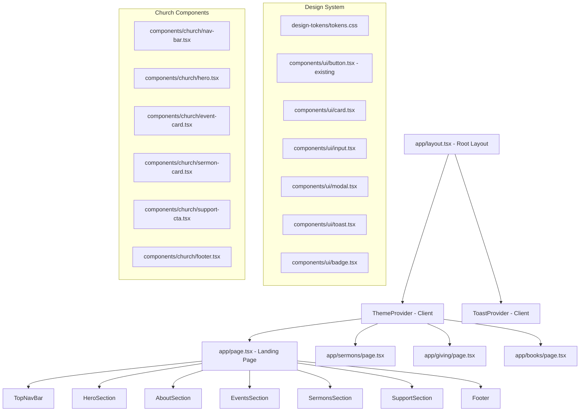
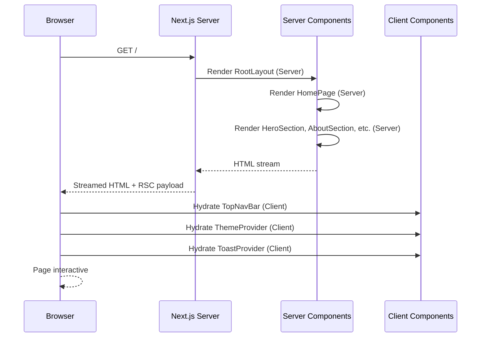

# Design Document: Church Landing Page

## Overview

A multi-page church website for **RCCG Glory Tabernacle**, built with Next.js 16 (App Router), TypeScript, and Tailwind CSS v4. The project is structured as a complete design system and UI component library, starting with a 7-section landing page and expanding to additional pages (giving, sermons, book sales, etc.) over time. The design system is built on top of the existing shadcn/radix-ui foundation already present in the project, extending it with church-specific design tokens and components.

The architecture prioritizes Server Components by default, dropping to Client Components only where interactivity is required (mobile menu, dark mode toggle, toast notifications, modals). All routing uses the Next.js 16 App Router with the `app/` directory.

## Architecture



## Routing Structure

```
app/
├── layout.tsx              ← Root layout: fonts, ThemeProvider, ToastProvider
├── globals.css             ← Design tokens + Tailwind base (existing, extended)
├── page.tsx                ← Landing page (assembles 7 sections)
├── sermons/
│   └── page.tsx            ← Sermons archive (future)
├── giving/
│   └── page.tsx            ← Giving/donation page (future)
└── books/
    └── page.tsx            ← Book sales page (future)
```

All pages are Server Components. Interactive sub-components use `'use client'` directive.

## Design Token Structure

Tokens are defined as CSS custom properties in `app/globals.css`, extending the existing shadcn token layer. The `@theme inline` block maps them into Tailwind's utility system.

```css
/* Church brand tokens — added to :root in globals.css */
:root {
  /* Brand Colors */
  --church-green: #1B6D24;
  --church-navy: rgba(27, 34, 119, 0.85);
  --church-light-green: rgba(163, 246, 156, 1);
  --church-white-transparent: rgba(255, 255, 255, 0.8);

  /* Semantic aliases */
  --color-brand-primary: var(--church-green);
  --color-brand-secondary: var(--church-navy);
  --color-brand-accent: var(--church-light-green);

  /* Typography scale */
  --font-display: var(--font-geist-sans);   /* headings */
  --font-body: var(--font-geist-sans);      /* body text */

  /* Spacing scale (extends Tailwind defaults) */
  --section-padding-y: 5rem;       /* py-20 equivalent */
  --section-padding-x: 1.5rem;     /* px-6 equivalent */
  --container-max: 80rem;          /* max-w-7xl */

  /* Shadows */
  --shadow-card: 0 2px 12px 0 rgba(27, 109, 36, 0.08);
  --shadow-nav: 0 2px 8px 0 rgba(0, 0, 0, 0.08);

  /* Border radius */
  --radius-card: 1rem;
  --radius-badge: 9999px;
}

/* Dark mode overrides */
.dark {
  --church-green: #2d9e3a;
  --church-light-green: rgba(163, 246, 156, 0.15);
  --color-brand-primary: var(--church-green);
}
```

Tailwind mapping in `@theme inline`:
```css
@theme inline {
  --color-brand-primary: var(--color-brand-primary);
  --color-brand-secondary: var(--color-brand-secondary);
  --color-brand-accent: var(--color-brand-accent);
}
```

## Component Breakdown with Props Interfaces

### TopNavBar

**File**: `components/church/nav-bar.tsx`  
**Directive**: `'use client'` (needs `usePathname`, mobile menu state, scroll detection)

```typescript
interface NavLink {
  label: string
  href: string
  children?: { label: string; href: string }[]  // dropdown items
}

interface TopNavBarProps {
  logo: {
    src: string
    alt: string
    width: number
    height: number
  }
  links: NavLink[]
  ctaLabel: string   // "GIVE"
  ctaHref: string    // "/give"
}

// Hardcoded nav links:
const NAV_LINKS: NavLink[] = [
  { label: 'Home', href: '/' },
  { label: 'About', href: '/about' },
  { label: 'Media', href: '/media', children: [
    { label: 'Sermons', href: '/sermons' },
    { label: 'Books', href: '/books' },
  ]},
  { label: 'Volunteer', href: '/volunteer' },
  { label: 'Connect', href: '/connect', children: [
    { label: 'Contact Us', href: '/contact' },
    { label: 'Small Groups', href: '/groups' },
  ]},
]
```

Visual reference (from design image):
- Background: `--church-navy` (always on, not transparent-on-scroll)
- Logo: circular RCCG emblem, far left
- Links: centered, white text, active link has green underline indicator
- Dropdowns: Media and Connect have chevron `▾` icons, reveal sub-menus on hover/click
- CTA: "GIVE" button far right — `--church-green` background, white text, rounded (`rounded-md`)
- Font: medium weight, slightly spaced

Behavior:
- Sticky (`position: sticky; top: 0`) with `z-50`
- Always shows `--church-navy` background (no scroll transparency change — matches design image)
- Dropdown menus open on hover (desktop) and tap (mobile)
- Mobile hamburger menu collapses all links into a slide-down drawer; dropdowns expand inline
- Active link highlighted with green bottom border via `usePathname()`
- Uses `next/link` for all navigation
- Chevron icon rotates 180° when dropdown is open

### HeroSection

**File**: `components/church/hero.tsx`  
**Directive**: `'use client'` (slideshow requires `useState` + `useEffect` for auto-advance)

```typescript
interface HeroSlide {
  backgroundImage: string   // path in /public
  headline: string
  subtext: string
}

interface HeroSectionProps {
  slides: HeroSlide[]
  primaryCta: { label: string; href: string }
  secondaryCta: { label: string; href: string }
  overlayOpacity?: number        // 0–1, default 0.5
  autoPlayInterval?: number      // ms, default 5000
}
```

Layout: Full-width (`w-full`), min-height `100svh`. Each slide uses `next/image` with `fill` + `object-cover`. Slides cross-fade using CSS `opacity` transition (`transition-opacity duration-1000 ease-in-out`). Overlay div with `--church-navy` at `overlayOpacity`. Content centered with `flex items-center justify-center`. Dot indicators at bottom for slide position. Auto-advances every `autoPlayInterval` ms, pauses on hover.

### AboutSection

**File**: `components/church/about-section.tsx`  
**Directive**: Server Component

```typescript
interface AboutSectionProps {
  heading: string
  body: string          // rich text or plain paragraph
  image: {
    src: string
    alt: string
    width: number
    height: number
  }
  missionStatement?: string
  visionStatement?: string
}
```

Layout: Two-column grid on `md+` (`grid-cols-2`), stacked on mobile. Image on one side, text on the other.

### EventsSection

**File**: `components/church/events-section.tsx`  
**Directive**: Server Component (cards are static; RSVP links navigate)

```typescript
interface ChurchEvent {
  id: string
  title: string
  date: string          // ISO 8601
  time: string
  location: string
  description: string
  image?: string
  registrationHref?: string
}

interface EventsSectionProps {
  heading: string
  events: ChurchEvent[]
  viewAllHref?: string
}
```

Layout: Responsive card grid — 1 col mobile, 2 col `sm`, 3 col `lg`. Uses `EventCard` component.

### EventCard

**File**: `components/church/event-card.tsx`  
**Directive**: Server Component

```typescript
interface EventCardProps {
  event: ChurchEvent
}
```

Renders: image (optional), date badge, title, time/location, description excerpt, optional registration button.

### SermonsSection

**File**: `components/church/sermons-section.tsx`  
**Directive**: Server Component

```typescript
interface Sermon {
  id: string
  title: string
  speaker: string
  date: string
  series?: string
  thumbnailSrc: string
  videoHref?: string
  audioHref?: string
  duration?: string
}

interface SermonsSectionProps {
  heading: string
  sermons: Sermon[]
  viewAllHref: string
}
```

Layout: Horizontal scroll on mobile, 3-column grid on `lg+`. Uses `SermonCard`.

### SermonCard

**File**: `components/church/sermon-card.tsx`  
**Directive**: Server Component (play buttons are `<a>` links)

```typescript
interface SermonCardProps {
  sermon: Sermon
}
```

Renders: thumbnail with play overlay, title, speaker, date, series badge, video/audio action buttons.

### SupportSection

**File**: `components/church/support-section.tsx`  
**Directive**: Server Component

```typescript
interface SupportSectionProps {
  heading: string
  body: string
  primaryCta: { label: string; href: string }
  secondaryCta?: { label: string; href: string }
  backgroundVariant?: 'green' | 'navy' | 'light'
}
```

Layout: Full-width banner with centered content. Background uses brand color based on `backgroundVariant`.

### Footer

**File**: `components/church/footer.tsx`  
**Directive**: Server Component

```typescript
interface FooterLink {
  label: string
  href: string
}

interface FooterColumn {
  heading: string
  links: FooterLink[]
}

interface SocialLink {
  platform: 'facebook' | 'x' | 'youtube' | 'tiktok' | 'instagram'
  href: string
}

// Platforms: Facebook, X (Twitter), YouTube, TikTok, Instagram

interface FooterProps {
  logo: { src: string; alt: string }
  columns: FooterColumn[]
  socialLinks: SocialLink[]
  contactInfo: {
    address: string
    phone: string
    email: string
  }
  copyrightText: string
}
```

Layout: 4-column grid on `lg+`, 2-column on `sm`, stacked on mobile.

## Shared UI Components

These extend the existing shadcn/radix foundation in `components/ui/`.

### Card

**File**: `components/ui/card.tsx`  
Variants: `default`, `elevated`, `outlined`  
Slots: `CardHeader`, `CardImage`, `CardBody`, `CardFooter`

### Badge

**File**: `components/ui/badge.tsx`  
Variants: `default`, `success`, `warning`, `info`, `outline`  
Used for event dates, sermon series labels.

### Modal / Dialog

**File**: `components/ui/modal.tsx`  
Built on `@radix-ui/react-dialog` (already in `radix-ui` package).  
Variants: `confirmation`, `form`, `alert`  
Accessibility: focus trap, `aria-labelledby`, `aria-describedby`, `Escape` to close.

### Toast

**File**: `components/ui/toast.tsx` + `components/ui/toast-provider.tsx`  
Built on `@radix-ui/react-toast`.  
Variants: `success`, `error`, `warning`, `info`  
Auto-dismiss: 5s default, configurable. Stacks up to 3 visible.

### Input Components

**File**: `components/ui/input.tsx`  
Types: `text`, `email`, `password`, `textarea`, `select`, `checkbox`, `radio`  
States: `default`, `focus`, `error`, `disabled`  
All include `aria-invalid`, `aria-describedby` for error messages.

## Page Layout & Data Flow

### Landing Page (`app/page.tsx`)

Server Component. Data for events and sermons is currently static (hardcoded arrays). When a CMS or API is added, data fetching moves here using `async/await` directly in the Server Component.

```typescript
// app/page.tsx — Server Component
import { TopNavBar } from '@/components/church/nav-bar'
import { HeroSection } from '@/components/church/hero'
// ... other imports

export default function HomePage() {
  // Static data — replace with fetch() calls when CMS is ready
  const events: ChurchEvent[] = [ /* ... */ ]
  const sermons: Sermon[] = [ /* ... */ ]

  return (
    <>
      <TopNavBar logo={...} links={NAV_LINKS} ctaLabel="Join Us" ctaHref="/contact" />
      <main>
        <HeroSection ... />
        <AboutSection ... />
        <EventsSection events={events} ... />
        <SermonsSection sermons={sermons} ... />
        <SupportSection ... />
      </main>
      <Footer ... />
    </>
  )
}
```

### State Management

No global state library needed at this stage. State is scoped to:

| Concern | Location | Mechanism |
|---|---|---|
| Mobile menu open/close | `TopNavBar` | `useState` |
| Scroll position for nav | `TopNavBar` | `useEffect` + `window.scrollY` |
| Dark mode | `ThemeProvider` | `useState` + `localStorage` + `class` on `<html>` |
| Toast queue | `ToastProvider` | `useState` array |
| Modal open/close | Radix Dialog | Radix internal state |

## Dark Mode Implementation

Strategy: class-based dark mode using Tailwind's `dark:` variant (already configured in `globals.css` via `@custom-variant dark (&:is(.dark *))`).

```typescript
// components/providers/theme-provider.tsx
'use client'

import { createContext, useContext, useEffect, useState } from 'react'

type Theme = 'light' | 'dark' | 'system'

interface ThemeContextValue {
  theme: Theme
  setTheme: (theme: Theme) => void
  resolvedTheme: 'light' | 'dark'
}

// Reads localStorage on mount, applies 'dark' class to <html>
// Respects prefers-color-scheme when theme === 'system'
```

The `ThemeProvider` wraps the root layout body. A `ThemeToggle` button component (`'use client'`) reads from context and calls `setTheme`. The `dark` class on `<html>` activates all `dark:` Tailwind utilities and the `.dark` CSS block in `globals.css`.

Church-specific dark mode token overrides are defined in the `.dark {}` block in `globals.css` (see Design Token Structure above).

## Sequence Diagram: Page Load



## Error Handling

- `app/not-found.tsx` — custom 404 page with nav and CTA back to home
- `app/error.tsx` — error boundary for runtime errors, shows friendly message
- Image fallbacks: all `next/image` components include meaningful `alt` text; broken images degrade gracefully

## Performance Considerations

- All section components are Server Components — zero JS bundle cost
- `next/image` handles responsive sizing, WebP conversion, lazy loading automatically
- Hero image uses `loading="eager"` (LCP element) — note: `priority` prop is deprecated in Next.js 16, use `preload` instead
- Sticky nav uses CSS `position: sticky` (no JS scroll listener for positioning, only for background color transition)
- `scroll-padding-top` set in `globals.css` to account for sticky nav height on anchor navigation

## Dependencies

All already present in `package.json`:

| Package | Usage |
|---|---|
| `next` 16 | App Router, Image, Link |
| `react` 19 | Server + Client Components |
| `tailwindcss` v4 | Utility styling |
| `radix-ui` | Dialog, Toast, accessible primitives |
| `class-variance-authority` | Component variant system |
| `clsx` + `tailwind-merge` | Conditional class merging via `cn()` |
| `lucide-react` | Icons (nav, social, play buttons) |
| `tw-animate-css` | Animation utilities |
| `shadcn` | Component scaffolding base |

## Correctness Properties

*A property is a characteristic or behavior that should hold true across all valid executions of a system — essentially, a formal statement about what the system should do. Properties serve as the bridge between human-readable specifications and machine-verifiable correctness guarantees.*

### Property 1: Navigation renders all provided links

*For any* array of `NavLink` objects passed to `TopNavBar`, every link's `label` and `href` must appear in the rendered output.

**Validates: Requirements 1.1**

---

### Property 2: Active link matches current pathname

*For any* array of `NavLink` objects and any pathname, exactly the link whose `href` equals the pathname should receive the active indicator class, and no other link should.

**Validates: Requirements 1.6**

---

### Property 3: Mobile menu open/close is a round trip

*For any* initial closed state of the TopNavBar mobile menu, opening and then closing the menu must restore the drawer to its original closed state with no residual open classes.

**Validates: Requirements 1.4, 1.5**

---

### Property 4: Hero dot count equals slide count

*For any* array of `HeroSlide` objects, the number of rendered dot indicators must equal the length of the slides array.

**Validates: Requirements 2.8**

---

### Property 5: Hero slide index wraps around

*For any* slides array of length N, calling the advance function when the current index is N−1 must produce index 0.

**Validates: Requirements 2.6**

---

### Property 6: AboutSection renders all provided fields

*For any* `AboutSectionProps`, the rendered output must contain the heading, body text, mission statement (when provided), and vision statement (when provided).

**Validates: Requirements 3.1**

---

### Property 7: EventsSection renders exactly as many cards as events

*For any* array of `ChurchEvent` objects, the rendered `EventsSection` must contain exactly that many `EventCard` instances.

**Validates: Requirements 4.1**

---

### Property 8: EventCard renders all required fields

*For any* `ChurchEvent`, the rendered `EventCard` must contain the date badge, title, time, location, and description excerpt.

**Validates: Requirements 4.6**

---

### Property 9: EventCard registration button presence matches registrationHref

*For any* `ChurchEvent`, a registration button must appear if and only if `registrationHref` is a non-empty string.

**Validates: Requirements 4.8, 4.9**

---

### Property 10: SermonsSection renders exactly as many cards as sermons

*For any* array of `Sermon` objects, the rendered `SermonsSection` must contain exactly that many `SermonCard` instances.

**Validates: Requirements 5.1**

---

### Property 11: SermonCard optional elements match their data fields

*For any* `Sermon`, the series Badge must appear if and only if `series` is set; the video button must appear if and only if `videoHref` is set; the audio button must appear if and only if `audioHref` is set.

**Validates: Requirements 5.6, 5.7, 5.8, 5.9, 5.10, 5.11**

---

### Property 12: SupportSection secondary CTA presence matches prop

*For any* `SupportSectionProps`, the secondary CTA button must appear if and only if `secondaryCta` is provided.

**Validates: Requirements 6.2, 6.3**

---

### Property 13: Footer renders all columns and their links

*For any* `FooterProps`, every `FooterColumn` heading and every `FooterLink` label within each column must appear in the rendered output.

**Validates: Requirements 7.1**

---

### Property 14: Footer renders all social links

*For any* array of `SocialLink` objects in `FooterProps`, every social link must produce a rendered anchor element in the footer.

**Validates: Requirements 7.2**

---

### Property 15: Footer renders all contact info fields

*For any* `contactInfo` object, the rendered footer must contain the address, phone number, and email address.

**Validates: Requirements 7.3**

---

### Property 16: ThemeProvider persists theme to localStorage (round trip)

*For any* theme value in `{'light', 'dark', 'system'}`, after calling `setTheme` with that value, reading `localStorage.getItem('theme')` must return the same value.

**Validates: Requirements 9.5**

---

### Property 17: Toast queue never exceeds 3 visible toasts

*For any* sequence of toast additions, the number of simultaneously visible toasts must never exceed 3.

**Validates: Requirements 10.9**

---

### Property 18: Input aria-invalid reflects error state

*For any* `Input` component in an error state, `aria-invalid` must be `"true"` and `aria-describedby` must reference a non-empty error message element id.

**Validates: Requirements 10.11**

---

### Property 19: All images have non-empty alt text

*For any* rendered page in the application, every `` element in the DOM must have a non-empty `alt` attribute.

**Validates: Requirements 11.1**
